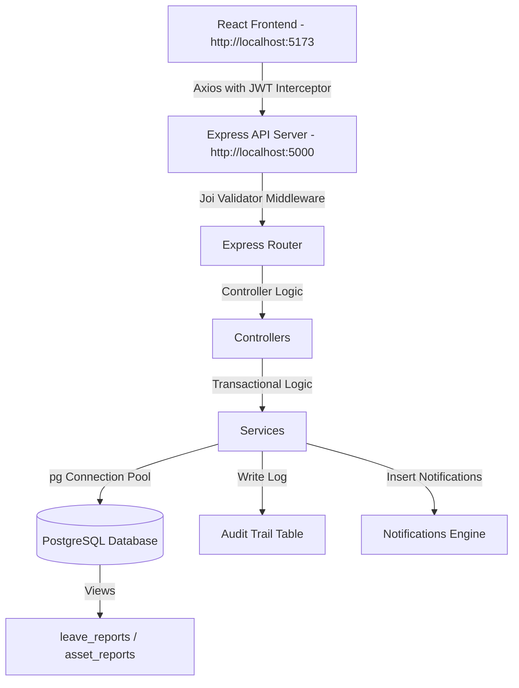

# 🚀 Enterprise HRMS & IT Inventory Tracking System

A full-stack, enterprise-grade Employee Directory, Leave Management, and IT Asset Tracking web application. Built with **React 19**, **Node.js/Express**, and **PostgreSQL**, it features role-based access control (RBAC), multi-level workflows, transactional state management, JSONB audit logging, precompiled database views, advanced query analytical reports, and a responsive glassmorphic dashboard.

---

## 📋 Table of Contents
- [Features](#features)
- [Tech Stack](#tech-stack)
- [Enterprise Architecture](#enterprise-architecture)
- [Project Structure](#project-structure)
- [Installation](#installation)
- [Database Setup](#database-setup)
- [Running the Application](#running-the-application)
- [Seeded Accounts](#seeded-accounts)
- [API Documentation](#api-documentation)
- [Database Relationships](#database-relationships)
- [Security Features](#security-features)
- [Learning Outcomes](#learning-outcomes)
- [Environment Variables](#environment-variables)
- [Troubleshooting](#troubleshooting)

---

## ✨ Features

### 🔐 Authentication & Multi-Role Authorization
- **Role-Based Security**: Clearances for **Admin**, **HR**, **Manager**, and **Employee** roles.
- **Session Tokens**: JWT-based session security with automatic client storage and Axios request interceptors.
- **Credential Protection**: Hashed passwords using `bcryptjs` with 10 salt rounds.
- **Access Control Middlewares**: Route-level guards to block unauthorized endpoints.

### 👥 Extended Employee Directory
- **Extended Profiles**: Tracks designation, salary, date of joining, contact phone, and addresses.
- **Multi-Image Library**: Support for uploading up to 5 images per employee profile via `multer`.
- **Competency Registry**: Many-to-Many skills mapping to track professional competencies.

### 🗓️ Leave Management & Approval Workflow
- **Multi-Level Approvals**: Leave applications flow from Employee → Manager Review → HR/Admin Final Approval.
- **Safe Database Transactions**: Auto-deduction of balances, updates to leave statuses, creation of audit logs, and notification triggers all run in safe Postgres transactions.
- **Approval Log**: History tracking for each step of the review process.

### 🕒 Daily Attendance Portal
- **Arrival Verification**: Clock-in feature that marks punctuality based on configured arrival windows.
- **Team Registry**: Summary sheet of check-in times and daily team status.

### 🔌 IT Asset Management System
- **Hardware Allocation & Tracking**: Full lifecycle tracking of laptops, monitors, access cards, etc., with statuses (`AVAILABLE`, `ALLOCATED`, `MAINTENANCE`).
- **Transactional Assignment**: Allocations and returns are executed within database transactions (`BEGIN`/`COMMIT`/`ROLLBACK`) to ensure data consistency, updates to asset status, and insertion of audit logs.
- **Audit Trails**: Capture before/after snapshots of inventory and allocation rows.

### 📊 Reports & Advanced SQL Analytics
- **Aggregated Summaries**: Real-time stats on departments, skills, leaves, and inventory.
- **Precompiled Database Views**: Reads complex reporting records instantly from `leave_reports` and `asset_reports` views.
- **Postgres Window Functions**: Employs `DENSE_RANK() OVER` query ranking employee absenteeism (total leave days).
- **Monthly Trends**: Aggregates leave request count trends by calendar month.
- **CSV Exporters**: Direct client-side downloads for tables on the Reports dashboard.

---

## 🛠️ Tech Stack

### Frontend
- **React.js 19** - Component-based user interface
- **React Context API** - Centralized user session state management
- **Custom React Hooks** - Isolated domain state and API logic (`useAuth`, `useLeave`, `useEmployee`)
- **Vite** - Build tool and local developer server
- **React Router 7** - Single page application client routing
- **Axios** - HTTP client with authentication header interceptors

### Backend
- **Node.js & Express** - Server runtime and API router
- **PostgreSQL** - Relational database
- **pg (node-postgres)** - Database driver with pool connection tuning
- **Joi** - Request body validator schema protection
- **Helmet** - Express HTTP header security
- **Express Rate Limit** - Brute-force request limitation
- **Multer** - Multipart file upload engine

---

## 🏗️ Enterprise Architecture



---

## 📁 Project Structure

```
I-soft-Project/
├── backend/
│   ├── config/
│   │   ├── db.js                    # pg Connection Pool
│   │   └── swagger.js               # Swagger documentation rules
│   ├── controllers/
│   │   ├── assetController.js       # Asset allocations, returns
│   │   ├── attendanceController.js  # Check-in portal logic
│   │   └── leaveController.js       # Leaves requests and approvals
│   ├── middleware/
│   │   └── authMiddleware.js        # JWT verification middleware
│   ├── routes/
│   │   ├── auth.js                  # Login & Profile endpoints
│   │   ├── employees.js             # Employee CRUD routes
│   │   ├── departments.js           # Departments CRUD routes
│   │   ├── skills.js                # Skills CRUD routes
│   │   ├── leaves.js                # Leaves workflow routes
│   │   └── assets.js                # Hardware inventory routes
│   ├── services/
│   │   ├── assetService.js          # Transactional asset services
│   │   ├── attendanceService.js     # Registry logs checks
│   │   └── leaveService.js          # Leave balances & rank analytics
│   ├── utils/
│   │   └── validation.js            # Joi verification middleware
│   ├── uploads/                     # Uploaded photos catalog
│   ├── index.js                     # Server entry point
│   ├── setup-complete-db.js         # Complete DB rebuild & seed script
│   └── package.json
│
├── frontend/
│   ├── src/
│   │   ├── components/
│   │   │   ├── ProtectedRoute.jsx   # Role route interceptor
│   │   │   ├── Button.jsx           # Styled button component
│   │   │   ├── Card.jsx             # Glassmorphism metric container
│   │   │   ├── Modal.jsx            # Dynamic modal framework
│   │   │   ├── Table.jsx            # Tabular reports renderer
│   │   │   └── Loader.jsx           # Animated page loader
│   │   ├── context/
│   │   │   └── AuthContext.jsx      # Session state provider
│   │   ├── hooks/
│   │   │   ├── useAuth.js           # Auth context consumer hook
│   │   │   ├── useLeave.js          # Leave api state hook
│   │   │   └── useEmployee.js       # Employee api state hook
│   │   ├── pages/
│   │   │   ├── Login.jsx            # Sign in
│   │   │   ├── Signup.jsx           # Registration
│   │   │   ├── Dashboard.jsx        # Admin / Employee Hub
│   │   │   ├── EmployeeList.jsx     # Directory sheet
│   │   │   ├── AssetManagement.jsx  # Inventory allocations
│   │   │   ├── AttendancePortal.jsx # Clock in panel
│   │   │   ├── LeaveDashboard.jsx   # Staff balance & requests
│   │   │   ├── LeaveApproval.jsx    # Review queue (Admin/HR/Mgr)
│   │   │   ├── Reports.jsx          # Window stats & CSV downloaders
│   │   │   └── Profile.jsx          # Security configs
│   │   ├── services/
│   │   │   └── api.js               # Central Axios client
│   │   ├── App.jsx                  # Main router definitions
│   │   └── index.css                # Global design system & animations
```

---

## 🔧 Installation

### Prerequisites
- Node.js (v16 or higher)
- PostgreSQL (v12 or higher)
- npm or yarn

### 1. Environment Setup
Create a `.env` file inside the `backend` folder:
```env
PORT=5000
DB_USER=postgres
DB_HOST=localhost
DB_NAME=loginapp
DB_PASSWORD=your_postgres_password
DB_PORT=5432
JWT_SECRET=super_secret_key_at_least_32_characters
```

### 2. Backend Installation & Setup
From the root workspace directory:
```bash
cd backend
npm install

# Initialize databases, tables, indexes, views, and seed data
node setup-complete-db.js

# Start backend dev server
npm run dev
```

### 3. Frontend Installation & Setup
From the root workspace directory in another terminal:
```bash
cd frontend
npm install

# Start Vite dev server
npm run dev
```
Open `http://localhost:5173/` in your browser.

---

## 👥 Seeded Accounts

The unified database setup seeds four sandbox accounts with specific clearance roles. All accounts use the password: `password123`.

| Name | Email | Role | Clearances |
|------|-------|------|------------|
| Admin User | `admin@company.com` | `ADMIN` | Complete access, system administration, asset allocation, master configuration |
| HR Manager | `hr@company.com` | `HR` | Employee profile management, asset allocation, leave reviews, view reporting metrics |
| Line Manager | `manager@company.com` | `MANAGER` | Leave reviews, clock-in, check stats, update profile |
| Standard Employee | `employee@company.com` | `EMPLOYEE` | View profile, apply for leaves, view allocated assets, clock-in |

---

## 📡 API Documentation

### IT Asset API Endpoints
All asset routes require authentication.

| Method | Endpoint | Clearance | Description |
|--------|----------|-----------|-------------|
| GET | `/api/assets` | ALL | Retrieve hardware list (supports search, filter, and pagination) |
| GET | `/api/assets/my-allocations` | ALL | Retrieve assets allocated to active session user |
| POST | `/api/assets` | ADMIN, HR | Create and register new inventory hardware |
| POST | `/api/assets/allocate` | ADMIN, HR | Allocate item to employee (runs safe SQL Transaction) |
| POST | `/api/assets/return` | ADMIN, HR | Mark item returned (runs safe SQL Transaction) |
| GET | `/api/assets/reports` | ADMIN, HR | Fetch asset report records from DB View |

### Leave Management & Reports Endpoints
All routes require authentication.

| Method | Endpoint | Clearance | Description |
|--------|----------|-----------|-------------|
| GET | `/api/leaves/admin/advanced-reports` | ADMIN, HR | Fetch absenteeism ranking and monthly request trends |
| GET | `/api/leaves/admin/reports` | ADMIN, HR | Fetch leave reporting records from database view |
| GET | `/api/leaves/admin/statistics` | ADMIN, HR, MANAGER | Fetch overall department leave statistics |
| POST | `/api/leaves` | EMPLOYEE | Submit leave application |
| PUT | `/api/leaves/:id/approve` | ADMIN, HR, MANAGER | Review and update status of leave requests |

---

## 🔗 Database Relationships

### One-to-Many Relationships
- **Users → Employee Profiles**: One user has exactly one profile.
- **Employee Profiles → Multiple Images**: One employee can upload up to 5 profile images.
- **Leave Applications → Approval History**: One leave application can have multiple approval logs.

### Many-to-Many Relationships
- **Employee Profiles ↔ Skills**: Managed via the `employee_skills` junction table.

### Postgres Views & SQL Highlights

**Asset Reports View (`asset_reports`):**
```sql
CREATE OR REPLACE VIEW asset_reports AS
SELECT 
  aa.id as allocation_id,
  a.id as asset_id,
  a.asset_name,
  a.asset_type,
  a.serial_number,
  u.id as employee_id,
  u.name as employee_name,
  d.department_name,
  ab.name as allocated_by_name,
  aa.allocated_at,
  aa.returned_at,
  aa.status as allocation_status,
  a.status as asset_status,
  aa.remarks
FROM asset_allocations aa
JOIN assets a ON aa.asset_id = a.id
JOIN users u ON aa.employee_id = u.id
LEFT JOIN employee_profiles ep ON u.id = ep.user_id
LEFT JOIN departments d ON ep.department_id = d.id
LEFT JOIN users ab ON aa.allocated_by = ab.id;
```

**Absenteeism Ranking Window Function:**
```sql
SELECT 
  u.name,
  SUM(la.total_days) as total_leaves,
  DENSE_RANK() OVER (ORDER BY SUM(la.total_days) DESC) as absenteeism_rank
FROM users u
JOIN leave_applications la ON u.id = la.employee_id
WHERE la.status = 'APPROVED'
GROUP BY u.id, u.name;
```

---

## 🔐 Security Features

- **Input Sanitization & Validation**: Powered by strict Joi schemas preventing bad payloads or inputs.
- **SQL Parameterization**: Using parameterized `$1, $2` variables in all database interactions to eliminate SQL Injection vectors.
- **Database Transaction Management**: Guarantees database operations (such as leave deductions and asset allocations) fully revert (`ROLLBACK`) on failure, ensuring data integrity.
- **HTTP Header Shielding**: `helmet` is active to secure response headers against clickjacking, MIME sniffing, and cross-site scripting.
- **Brute Force Defense**: `express-rate-limit` prevents brute-force credential cracking on registration and login endpoints.

---

## 🐛 Troubleshooting

### "Connection Refused" (Database offline)
Ensure PostgreSQL is active on your device and matching credentials:
```bash
psql -U postgres
```

### Schema Out of Sync
To force rebuild database schemas, indexes, views, and seed data:
```bash
node backend/setup-complete-db.js
```

### Image Upload Not Writing to Disk
Verify the `/uploads` catalog exists on the backend server:
```bash
mkdir backend/uploads
```

---

## 📄 License
This project is built as part of an advanced full-stack engineering internship training. All rights reserved.
