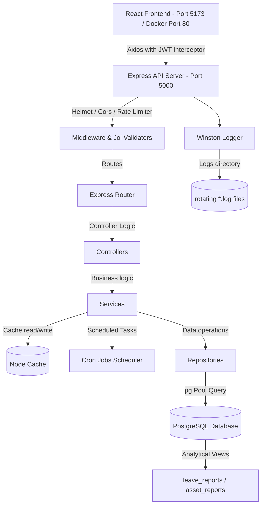

# 🚀 Enterprise HRMS & IT Inventory Tracking System

A full-stack, production-ready, enterprise-grade Employee Directory, Leave Management, IT Asset Tracking, Group Teams Collaboration, and Live System Monitoring web application. Built with **React 19**, **Node.js/Express**, and **PostgreSQL**, this system implements a clean architecture separating HTTP routing, controller execution, service logic, validator schema checks, and database access through a decoupled **Repository Pattern**.

---

## 📋 Table of Contents
- [Features](#-features)
- [Tech Stack](#-tech-stack)
- [Enterprise Architecture](#-enterprise-architecture)
- [Project Structure](#-project-structure)
- [Multi-Environment Configuration](#-multi-environment-configuration)
- [Installation & Local Setup](#-installation--local-setup)
- [Containerization & Docker Deployment](#-containerization--docker-deployment)
- [Running Automated Tests](#-running-automated-tests)
- [Background Scheduled Jobs (Cron)](#-background-scheduled-jobs-cron)
- [Seeded Accounts](#-seeded-accounts)
- [API Documentation](#-api-documentation)
- [Database Relationships & SQL Highlights](#-database-relationships--sql-highlights)
- [Security Features](#-security-features)
- [Troubleshooting](#-troubleshooting)

---

## ✨ Features

### 🔐 Authentication & Multi-Role Authorization
- **Role-Based Access Control (RBAC)**: Fine-grained clearances for **Admin**, **HR**, **Manager**, and **Employee** roles.
- **Session Security**: JWT-based session tokens with automatic local storage and Axios request interceptors.
- **Credential Protection**: Secure password hashing with `bcryptjs` (10 rounds).
- **Access Control Middlewares**: Route-level guards blocking unauthorized API endpoints.

### 👥 Extended Employee Directory
- **Detailed Profiles**: Tracks designation, salary, date of joining, contact details, and addresses.
- **Multi-Image Library**: Support for uploading up to 5 images per employee profile via `multer`.
- **Competency Registry**: Many-to-Many skills mapping tracking professional competencies.

### 🗓️ Leave Management & Approval Workflows
- **Multi-Level Approvals**: Leave requests flow through Employee → Manager Review → HR/Admin Final Approval.
- **Transactional Consistency**: SQL transactions handle auto-deduction of balances, leave status updates, audit logs, and notification triggers atomically.

### 🕒 Daily Attendance Portal
- **Arrival Verification**: Clock-in interface marking punctuality based on configured arrival windows.
- **Team Registry**: Daily check-in rosters showing check-in times and statuses.

### 🔌 IT Asset Management System
- **Hardware Lifecycle Allocation**: Full tracking of items (laptops, monitors, access cards) across statuses (`AVAILABLE`, `ALLOCATED`, `MAINTENANCE`).
- **Audit Trails**: Capture snapshot logs of inventory allocations and returns inside SQL transactions.

### 👥 Group Teams Collaboration Module
- **Team Operations**: Create, update, and manage team boundaries and member rosters.
- **Milestone Project Tracking**: Assign milestone deliverables and jobs to teams, maintaining target deadlines and completions.
- **Live Leaderboards**: Compute and render team leaderboard standings sorted by project completion rates.
- **Calendar & Leave Conflict Overlay**: Interactive calendar showing team schedules and automatically highlighting active leave conflicts to prevent booking overlap.

### 📊 System Diagnostics & Live Monitoring Panel
- **Real-Time Monitoring**: Interactive UI tracking system status, process uptime, memory footprint, request frequency, and database ping times.
- **Winston Logger Logs Viewer**: Administrative dashboard showing live tail streams of rotating `error.log` and `combined.log` files.

### 📈 Advanced SQL Analytics
- **Precompiled Views**: Accelerated reporting via Postgres views (`leave_reports` and `asset_reports`).
- **Absenteeism Ranking**: Computes staff ranking based on total approved leave days using Postgres window functions (`DENSE_RANK() OVER`).
- **Exporter Tools**: Client-side CSV downloaders for analytical tables.

---

## 🛠️ Tech Stack

### Frontend
- **React 19** - UI component framework
- **React Context API** - Global user session state management
- **Vite** - High-speed build tool and local dev server
- **React Router 7** - Single Page Application routing
- **Axios** - HTTP client equipped with request interceptors
- **Premium Layout Components** - Glassmorphic panels featuring `SplitLayout`, `ContextPanel`, and `IconStrip`

### Backend
- **Node.js & Express** - Runtime and web server framework
- **PostgreSQL** - Relational database engine
- **pg (node-postgres)** - Database client with pool configuration
- **Node Cache** - Local memory caching wrapper for fast reads
- **Node-Cron** - Background cron job runner for automated report compilation, mock DB backups, and notification cleaning
- **Winston** - Rotating file-logging framework split into `error.log` and `combined.log`
- **Joi** - Validation schema engine protecting all resource boundaries
- **Helmet & Express Rate Limit** - Security headers and brute-force defenses

### Containerization & CI/CD
- **Docker & Docker Compose** - Containerizing Postgres, Node Backend, and Nginx Frontend
- **Nginx** - Web server hosting static React client builds and handling routing fallbacks
- **GitHub Actions** - Build-test automation pipeline validating Jest tests and Docker images

---

## 🏗️ Enterprise Architecture



---

## 📁 Project Structure

```
I-soft-Project/
├── .github/
│   └── workflows/
│       └── build-test-deploy.yml    # CI/CD test and docker build workflow
├── backend/
│   ├── config/
│   │   ├── db.js                    # pg Connection Pool
│   │   ├── env.js                   # Multi-environment variable loader
│   │   ├── logger.js                # Winston logger rotation config
│   │   ├── cache.js                 # NodeCache global instance
│   │   └── swagger.js               # Swagger documentation rules
│   ├── controllers/                 # Express route controllers
│   │   ├── assetController.js
│   │   ├── attendanceController.js
│   │   ├── authController.js
│   │   ├── departmentController.js
│   │   ├── employeeController.js
│   │   ├── leaveController.js
│   │   ├── skillController.js
│   │   └── teamController.js
│   ├── repositories/                # Database Repository Access Layer
│   │   ├── assetRepository.js
│   │   ├── attendanceRepository.js
│   │   ├── departmentRepository.js
│   │   ├── employeeRepository.js
│   │   ├── leaveRepository.js
│   │   ├── skillRepository.js
│   │   ├── teamRepository.js
│   │   └── userRepository.js
│   ├── services/                    # Business Service logic
│   │   ├── assetService.js
│   │   ├── attendanceService.js
│   │   ├── authService.js
│   │   ├── departmentService.js
│   │   ├── emailService.js
│   │   ├── employeeService.js
│   │   ├── leaveService.js
│   │   ├── skillService.js
│   │   └── teamService.js
│   ├── validators/                  # Joi validation schema guards
│   │   ├── asset.validator.js
│   │   ├── attendance.validator.js
│   │   ├── auth.validator.js
│   │   ├── department.validator.js
│   │   ├── employee.validator.js
│   │   ├── leave.validator.js
│   │   ├── skill.validator.js
│   │   └── team.validator.js
│   ├── jobs/
│   │   └── cronJobs.js              # Background Cron Manager
│   ├── middleware/
│   │   ├── authMiddleware.js        # JWT verification guard
│   │   ├── errorHandler.js          # Unified Exception interceptor
│   │   └── loggerMiddleware.js      # Winston HTTP logs middleware
│   ├── routes/                      # API endpoint configurations
│   │   ├── assets.js
│   │   ├── attendance.js
│   │   ├── auth.js
│   │   ├── departments.js
│   │   ├── employees.js
│   │   ├── health.js                # System Diagnostics
│   │   ├── leaves.js
│   │   ├── skills.js
│   │   └── teams.js                 # Teams Management
│   ├── tests/                       # Jest integration testing suites
│   │   ├── auth.test.js
│   │   ├── employee.test.js
│   │   └── leave.test.js
│   ├── uploads/                     # Employee avatar storage directory
│   ├── index.js                     # Server entry point
│   ├── setup-complete-db.js         # Complete DB rebuild & seed script
│   ├── Dockerfile
│   └── package.json
├── frontend/
│   ├── src/
│   │   ├── components/
│   │   │   ├── ProtectedRoute.jsx
│   │   │   ├── Button.jsx
│   │   │   ├── Card.jsx
│   │   │   ├── Modal.jsx
│   │   │   ├── Table.jsx
│   │   │   ├── Loader.jsx
│   │   │   ├── SplitLayout.jsx      # Multi-pane dashboard layout
│   │   │   ├── ContextPanel.jsx     # Side help pane
│   │   │   └── IconStrip.jsx        # Dashboard action strip
│   │   ├── pages/
│   │   │   ├── Login.jsx
│   │   │   ├── Signup.jsx
│   │   │   ├── Dashboard.jsx
│   │   │   ├── EmployeeList.jsx
│   │   │   ├── AssetManagement.jsx
│   │   │   ├── AttendancePortal.jsx
│   │   │   ├── LeaveDashboard.jsx
│   │   │   ├── LeaveApproval.jsx
│   │   │   ├── Reports.jsx
│   │   │   ├── Profile.jsx
│   │   │   ├── SkillsMaster.jsx
│   │   │   ├── TeamDashboard.jsx    # Teams Overview
│   │   │   ├── TeamCalendar.jsx     # Schedule overlay & conflicts
│   │   │   ├── TeamDetail.jsx       # Roster & job deliverables
│   │   │   └── MonitoringDashboard.jsx # Diagnostics monitoring
│   │   ├── services/
│   │   │   └── api.js
│   │   ├── App.jsx
│   │   └── index.css
│   ├── Dockerfile
│   ├── nginx.conf                   # Frontend production Nginx config
│   └── package.json
├── docker-compose.yml               # Multi-container orchestration
└── postman_collection.json          # API testing collection
```

---

## ⚙️ Multi-Environment Configuration

The application loads variables dynamically based on `process.env.NODE_ENV`. Environment configuration files are placed in `/backend` folder:
- `backend/.env.development` - Dev environments
- `backend/.env.staging` - Staging simulation
- `backend/.env.production` - Docker staging/prod
- `backend/.env.test` - Automated Jest test configuration

A template `.env.example` shows the required variables:
```env
PORT=5000
DB_USER=postgres
DB_HOST=localhost
DB_NAME=loginapp
DB_PASSWORD=your_postgres_password
DB_PORT=5432
JWT_SECRET=super_secret_key_at_least_32_characters
```

---

## 🔧 Installation & Local Setup

### Prerequisites
- Node.js (v18 or higher)
- PostgreSQL (v12 or higher)
- npm

### 1. Database Setup
Ensure Postgres is active. Run the complete seed script to rebuild all tables, database schemas, indices, database views, and populate sandbox test accounts:
```bash
cd backend
npm install

# Force rebuild schemas, views, and seed accounts
node setup-complete-db.js
```

### 2. Start Services Locally

**Backend Server:**
```bash
cd backend
# Starts in development mode using nodemon
npm run dev
```
Server runs on `http://localhost:5000`. API documentation is available at `http://localhost:5000/api-docs`.

**Frontend Server:**
```bash
cd frontend
npm install
npm run dev
```
Client runs on `http://localhost:5173`.

---

## 🐳 Containerization & Docker Deployment

A full orchestration configuration is ready. Make sure Docker is running on your machine, then execute:

```bash
# Build and run containers in background
docker-compose up -d --build
```

### Services Started:
1. **db**: PostgreSQL database container listening internally on port `5432` with volume mapping (`pgdata`) for database persistence.
2. **backend**: Node.js application running on `http://localhost:5000` with volumes mapping logs and employee uploads.
3. **frontend**: React bundle built via Vite and served using Nginx on `http://localhost:80`.

To stop the containers:
```bash
docker-compose down -v
```

---

## 🧪 Running Automated Tests

A comprehensive integration test suite is located in `backend/tests` to run checks on core routes.

```bash
cd backend
# Runs Jest test cases on auth, employee, and leave requests
npm run test
```
*Note: Test configurations will utilize `backend/.env.test` variables.*

---

## ⏰ Background Scheduled Jobs (Cron)

The system manages critical automated operations using a Node-Cron scheduler:
1. **Daily Leave Reports** (Scheduled at 8:00 PM): Scans pending leave applications and alerts managers.
2. **Daily Database Backups** (Scheduled at 2:00 AM): Triggers a database backup serialization.
3. **Notification Cleanups** (Scheduled at 3:00 AM): Cleans the notification collection by deleting read records older than 30 days.

---

## 👥 Seeded Accounts

All seeded sandboxed test accounts use the password: `password123`.

| Name | Email | Role | Access Level / Clearance |
|------|-------|------|-------------------------|
| Admin User | `admin@company.com` | `ADMIN` | System configuration, full CRUD, Asset setup, Diagnostics access |
| HR Manager | `hr@company.com` | `HR` | Manage profiles, leave approvals, allocations |
| Line Manager | `manager@company.com` | `MANAGER` | Team overview, clock-in, leave approval review |
| Standard Employee | `employee@company.com` | `EMPLOYEE` | Apply leaves, view personal assets, daily clock-in |

---

## 📡 API Documentation

Interactive Swagger documentation is available at `http://localhost:5000/api-docs`.

### Selected Critical API Routes:

#### 👥 Group Teams Collaboration API
*Requires authentication.*
- `GET /api/v1/teams` - Retrieve list of all teams.
- `GET /api/v1/teams/:id` - Fetch details of a team, members roster, and jobs.
- `POST /api/v1/teams` - Register a new team.
- `PUT /api/v1/teams/:id` - Update team boundaries.
- `DELETE /api/v1/teams/:id` - Delete a team.
- `POST /api/v1/teams/:id/members` - Enroll a user into the team.
- `DELETE /api/v1/teams/:id/members/:userId` - Expel a member from the team.
- `POST /api/v1/teams/:id/jobs` - Create milestone project job for a team.
- `GET /api/v1/teams/:id/conflicts` - Evaluate active leave conflicts.
- `GET /api/v1/teams/leaderboard` - Public leaderboard sorted by completion rates.

#### 🩺 Health & Logs Diagnostics API
- `GET /api/v1/health` - Live check reporting process uptime, memory footprint, requests stats, and Postgres ping.
- `GET /api/v1/health/logs` - *Admin Only*. Live tail of Winston logs files (`error.log` / `combined.log`).

#### 🗓️ Leave Management API
- `GET /api/v1/leaves/admin/reports` - Retrieve complex report records from Postgres DB view.
- `GET /api/v1/leaves/admin/advanced-reports` - Fetch absenteeism window rankings (`DENSE_RANK()`).
- `POST /api/v1/leaves` - Apply for leaves.
- `PUT /api/v1/leaves/:id/approve` - Approve or reject leave applications.

---

## 🔗 Database Relationships & SQL Highlights

### Schema Relationships
- **Users ↔ Employee Profiles**: 1:1 binding.
- **Employee Profiles ↔ Skills**: Many-to-Many through `employee_skills` junction.
- **Teams ↔ Users**: Many-to-Many roster association.
- **Leave Applications ↔ Approvals**: 1:Many workflow history tracking.

### Postgres Window Function: Absenteeism Rank
Used to compile statistics on total approved absences per user:
```sql
SELECT 
  u.name,
  SUM(la.total_days) as total_leaves,
  DENSE_RANK() OVER (ORDER BY SUM(la.total_days) DESC) as absenteeism_rank
FROM users u
JOIN leave_applications la ON u.id = la.employee_id
WHERE la.status = 'APPROVED'
GROUP BY u.id, u.name;
```

---

## 🔐 Security Features

1. **Strict Input Sanitization**: Schema validators configured via Joi shield each database gate.
2. **Parameterized Queries**: SQL parameter injections prevent SQLi attacks.
3. **Database Transactions**: Workflows executing multi-stage queries run under transaction controls.
4. **Helmet Shielding**: Prevents clickjacking and header manipulation.
5. **Rate Limiting**: Throttles registration/login endpoints to defend against dictionary attacks.

---

## 🐛 Troubleshooting

### "Connection Refused" (Database Offline)
Ensure the Postgres local service is active:
```bash
psql -U postgres -d loginapp
```

### Resetting/Re-seeding database schema
If database schemas are out-of-sync or data is corrupt, force run:
```bash
node backend/setup-complete-db.js
```

### Upload directory issues
If profile images fail to write, manually verify `backend/uploads/` exists:
```bash
mkdir -p backend/uploads/employees
```

---

## 📄 License
This codebase is developed as part of an advanced full-stack engineering training program. All rights reserved.
